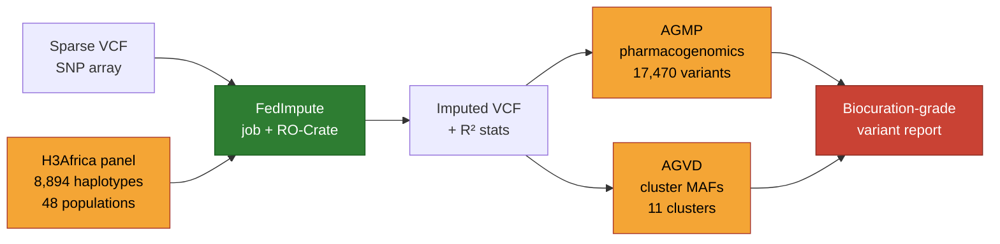

# Theory: African diversity, reference panels, biocuration

The 20-minute theory slot at the top of the workshop
(14:35--14:55) frames the three hands-on sessions
that follow. It is deliberately short -- just enough
context to read the plots you're about to generate,
and to recognise why each step is a **biocuration**
task, not just a computational one.

::: tip 20-min live + deeper reading
The live presentation covers the **headline idea**
of each of the three sections below in ~6 minutes
each (18 min + 2 min Q&A buffer). Each section
carries additional depth intended as pre- or
post-workshop reading -- use the "On this page"
outline to jump straight to the subsections that
matter for your own project.
:::

::: info Why these three themes together
Imputation accuracy depends on **African genetic
diversity** (the biological reality). Accuracy gains
come from **reference panels** that capture that
diversity. Panels, variants, and frequencies only
become reliable resources through **biocuration**.
Each section feeds the next.
:::

**Audience note:** most participants self-rate at
*Below average* to *Average* on "Foundations of
biocuration". Sections 1-2 assume genomics literacy
(VCF, MAF, haplotypes); section 3 assumes nothing and
builds the biocuration framing from first principles.

---

## 1. African genetic diversity (≈6 min live; ~10 min with extended reading)

### The oldest branch

Modern humans originated in sub-Saharan Africa
~200-300 thousand years ago. The Out-of-Africa
migration ~60 kya took a **single bottlenecked sample**
of this diversity and seeded every non-African
population. What remained in Africa is everything --
including the oldest branches of the human tree.

Practical consequence:

- African genomes have **more total variants** than
  any other continental group
- African haplotypes are **shorter** -- LD decays over
  shorter physical distances, meaning you need denser
  tagging to recover the same signal
- **Many African variants are absent** from panels
  built on European or admixed samples

### Sub-continental structure

"African" is not one population. Informative levels of
structure include:

- **West African:** Yoruba, Esan, Mende, Gambian...
- **East African:** Luhya, Kikuyu, Maasai, Somali...
- **Southern African:** Zulu, Sotho, Khoe-San, Tswana...
- **Central African:** Baka, Mbuti, Bantu-speaking
  Cameroonians...
- **North African:** Berber, Arab, Nilotic-influenced
  Sudanese...

AGVD's **11 population clusters** (see
[`/agvd`](/agvd)) reflect exactly this reality: they
resolve Western / Eastern / Southern / Central /
Northern Africa separately, plus Ex-Africa cohorts
(African-ancestry populations outside the continent)
and global comparators.

*AGVD's cluster filters aren't an arbitrary UI
choice; they encode the sub-continental structure of
the African genome and refuse to let the analyst
collapse it into a single "AFR" bin.*

### H3Africa, AGVP, and the data that exists

Two initiatives created the base layer of African
genomic data:

- **H3Africa Consortium** (since 2012): pan-African
  genomic research network, funded by NIH and Wellcome.
  Produced the H3Africa reference panel -- 8,894
  haplotypes from **48 populations** -- purpose-built
  for African imputation.
- **African Genome Variation Project (AGVP)** ([Gurdasani
  et al. 2015][gurdasani]): the first continental-scale
  sequencing of African populations, laying out the
  genetic-structure map later refined by AGVD and
  others.

[gurdasani]: https://doi.org/10.1038/nature13997

### Why this matters for curation

A variant annotated as "African MAF 3%" is almost
always *under-curated*. It should be: "Western African
MAF 4.2% / Eastern African MAF 1.1% / Southern African
MAF 7.8%". The continent-scale rollup is a floor; the
sub-continental breakdown is the science.

This is the curation posture AfriGen-D takes across
its resources -- and the reason the workshop spends
time on AGVD's cluster-level search rather than just
gnomAD's "AFR" bin.

::: warning The Khoe-San gap
[Sengupta et al. 2023][sengupta-theory] -- the paper
that underpins the reference-panel discussion in
section 2 -- found that **imputation discordance
rises with the proportion of Khoe-San ancestry** in
an individual, across *every* panel they evaluated,
including the African-specific AGR. Even the best
current panel under-represents Khoe-San populations.
This is the concrete empirical case for why
"Africa" cannot be treated as one population in a
reference panel, a GWAS, or an ACMG classification.
:::

[sengupta-theory]: https://doi.org/10.1016/j.xgen.2023.100332

---

## 2. Reference panels (≈6 min live; ~10 min with extended reading)

### What a reference panel is

A reference panel is a collection of **densely
typed** (sequenced or chip + imputed + validated)
individuals whose haplotypes serve as a template.
Imputation takes your **sparse** genotypes (SNP-array
variants at, say, 500K–2M positions) and predicts the
millions of untyped positions by finding matching
haplotypes in the panel.

Accuracy depends on two things:

1. Does the panel **contain** the variant you are
   trying to impute?
2. Is there a **closely matching haplotype** for your
   sample in the panel?

Both are population-dependent. A panel of 100,000
European samples can fail badly on a variant that is
rare in Europe but common in East Africa.

### The public panel landscape

Several public reference panels are in routine use,
each hosted by a different imputation service. The
one-line summary:

- **H3Africa v6** (AfriGen-D / H3ABioNet) and **AGR**
  (Sanger) -- the two African-focused panels,
  relatively small but population-matched
- **TOPMed r3** (TOPMed Server) -- the largest public
  panel at 133,597 samples, multi-ancestry
- **HRC r1.1** and **1000 Genomes Phase 3** --
  legacy / European-weighted

For full specs, the hosting services, sample counts,
access models, and a decision guide, see the
**[Services & panels page](/services)**.

### What the benchmark actually says

[Sengupta et al. 2023][sengupta] -- co-led by
AfriGen-D / H3Africa contributors including the
workshop organiser -- evaluated five reference panels
on ~11,000 sub-Saharan African participants from
AWI-Gen. Lower **non-reference discordance rate
(NDR)** is better:

| Panel | NDR on SSA samples |
| --- | --- |
| **AGR** (African-specific) | **2.23 % ± 0.58 %** |
| TOPMed | 3.57 % ± 1.88 % |
| KGP 1000G (Michigan / Sanger) | 6.74 – 7.01 % |
| HRC | 7.64 % ± 2.28 % |

The African-specific AGR panel halved TOPMed's
discordance and was ~70% more accurate than HRC --
despite being **about 20× smaller** than TOPMed. Size
is not destiny; **population match** is.

[sengupta]: https://doi.org/10.1016/j.xgen.2023.100332

### Panel choice *is* a curation decision

Picking the wrong panel is analytically cheap and
scientifically expensive. FedImpute's federated pitch
is: **don't force the African cohort onto a single
Eurocentric panel**. The platform hosts African-
specific panels (H3Africa v6 / v7) on African
infrastructure (ILIFU / UCT), with further federated
African nodes to follow. Michigan and TOPMed
imputation servers are **separate, non-federated
services** -- FedImpute is an African-first
alternative, not a proxy in front of them. The
curator's job in either case is to document the
panel + service choice with full provenance
(RO-Crate) so downstream analyses can interpret the
output correctly.

---

## 3. Biocuration context (≈6 min live; ~10 min with extended reading)

### Biocuration in one sentence

**Biocuration** is the structured, expert-reviewed
process of assembling data from disparate sources
(literature, databases, sequencing, arrays) into a
**reusable resource** whose annotations you can trust.

Curation is the *process*; annotations are the
*output*. Without curation, an annotation is a
one-person guess that didn't scale. With curation, it
is a versioned, provenanced claim with known
provenance, known quality controls, and a known
update cadence ([Howe et al. 2008][howe]).

[howe]: https://doi.org/10.1038/455047a

### FAIR as the north star

The [FAIR Guiding Principles][wilkinson] ([Wilkinson
et al. 2016][wilkinson]) define four properties of a
well-curated resource:

- **Findable** -- globally unique persistent
  identifiers; indexed; discoverable
- **Accessible** -- retrievable by identifier through
  standard protocols, with authentication where
  needed
- **Interoperable** -- uses open, community-governed
  standards (ontologies, schemas, formats)
- **Reusable** -- rich metadata, clear licence,
  documented provenance

[wilkinson]: https://doi.org/10.1038/sdata.2016.18

FAIR is not a checklist you complete; it is a
gradient along which your resource moves over time
through deliberate curation work.

### The AfriGen-D curation stack

Today's hands-on walks three resources, each of which
is a different kind of curation, composed into one
pipeline:

<!-- markdownlint-disable MD013 -->

| Resource | Curated object | Sources |
| --- | --- | --- |
| **AGMP** | Pharmacogenomic variants | PharmGKB + DisGeNET + GWAS Catalogue, African-filtered |
| **AGVD** | Allele frequencies | African cohort WGS joint call set, 11 population clusters |
| **FedImpute** | Imputation jobs + outputs | Reference panels, VCF inputs, RO-Crate-wrapped provenance |

<!-- markdownlint-enable MD013 -->

Each node in the pipeline is either *curated* (yellow)
or *compute* (green). The sparse input you bring and
the biocuration-grade output you leave with are
separated by three curated layers and one compute
layer -- drop any of them and the output is just
annotation without provenance.

**The provenance chain survives** because every edge
uses a community standard: GA4GH WES / DRS for the
compute, PharmGKB / DisGeNET / GWAS Catalogue on the
curation side, RO-Crate to package them together.

### What a biocurator should leave with

By the end of today's workshop the expectation is not
that you become an imputation expert. It is that you
can:

1. **Evaluate** a reference panel for your population
   of interest
2. **Lookup** pharmacogenomic and frequency evidence
   for a variant without defaulting to a
   European-weighted resource
3. **Recognise** the curation layer in each AfriGen-D
   tool, and know where its provenance lives
4. **Feed the curation back** -- report issues,
   suggest new signals, contribute to ongoing data
   resources

---

## Ready for the hands-on?

The theory ends here. Next:

- [**Tutorial: Genotype Imputation**](/tutorial) --
  the long-form walkthrough (GWAS → impute → GWAS
  loop, aligned to the [schedule](/schedule))
- [**AGMP session**](/agmp) -- pharmacogenomic variant
  lookups
- [**AGVD session**](/agvd) -- population-specific
  frequency queries

### References

- Gurdasani D. et al. (2015). *The African Genome
  Variation Project shapes medical genetics in
  Africa.* Nature 517, 327–332.
  <https://doi.org/10.1038/nature13997>
- Howe D. et al. (2008). *Big data: The future of
  biocuration.* Nature 455, 47–50.
  <https://doi.org/10.1038/455047a>
- Sengupta D. et al. (2023). *Performance and
  accuracy evaluation of reference panels for
  genotype imputation in sub-Saharan African
  populations.* Cell Genomics 3(6), 100332.
  <https://doi.org/10.1016/j.xgen.2023.100332>
- Wilkinson M.D. et al. (2016). *The FAIR Guiding
  Principles for scientific data management and
  stewardship.* Scientific Data 3, 160018.
  <https://doi.org/10.1038/sdata.2016.18>
